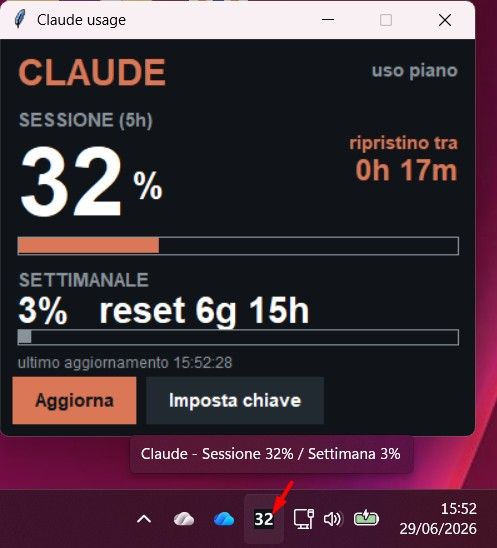

# Claude Usage Monitor

A small desktop app that shows your **Claude.ai plan usage** at a glance: the
**5-hour session** window and the **weekly** window, each with a usage
percentage and a countdown to the next reset.

When minimized, the window disappears and only a **system-tray icon** remains
(next to the clock), displaying just the percentage — colour-coded by level
(white < 70%, orange 70–89%, red ≥ 90%).

> ⚠️ This tool talks to Claude.ai's **unofficial internal API** using your
> session cookie. It is for personal use only. See the disclaimer below.
>
> 

## Features

- 5-hour session and weekly usage, in percent, with reset countdowns.
- Dark, minimal UI (ported from an original ESP32 / M5Stack build).
- System-tray icon showing the live percentage; double-click to restore the
  window, right-click for *Show / Refresh / Quit*. Hover shows both values.
- Auto-refresh every 2 minutes, countdown tick every 30 seconds, manual
  refresh button.
- Session key is entered from the UI and stored locally — never hard-coded.
- Zero hard dependencies for the core: uses `requests` if present, otherwise
  the standard-library `urllib`. The tray needs `pystray` + `pillow`.

## Requirements

- Python 3.9+
- Optional (recommended) for the tray icon:
  ```
  pip install pystray pillow
  ```
- Optional: `pip install requests`

Without `pystray`/`pillow` the app still runs; minimizing just behaves
normally (no tray icon).

## Usage

```
python claude_usage_monitor.py
```

On first launch it shows **"Manca sessionKey"**. Click **Imposta chiave**
(*Set key*), paste your session key, and **Salva**.

### Getting your session key

1. Open **claude.ai** while logged in.
2. Press **F12** → **Application** → **Cookies** → `https://claude.ai`.
3. Copy the value of the **`sessionKey`** cookie (it starts with
   `sk-ant-sid01-...`).

You can paste the bare value, `sessionKey=...`, or even a whole `Cookie:`
line — the app isolates the right part automatically. The key is a
**HttpOnly** cookie, so it is not readable from the JS console; take it from
the Cookies panel or the request headers.

The key is saved to `~/.claude_usage_monitor.json` (mode `600` on Linux/macOS).
When you see **"Sessione scaduta"** (*session expired*), just repeat the steps
and paste a fresh key.

## Configuration

In the top of the script:

- `TRAY_METRIC` — `"session"` (default) or `"weekly"`: which percentage the
  tray icon displays.
- `FETCH_INTERVAL_MS`, `TICK_INTERVAL_MS` — refresh and countdown intervals.

## Building a standalone executable

With [PyInstaller](https://pyinstaller.org/):

```bat
pip install pyinstaller pystray pillow
python -m PyInstaller --onedir --windowed --name ClaudeUsageMonitor claude_usage_monitor.py
```

The build is **platform-specific** (build the Windows `.exe` on Windows).
`--onedir` (folder build) is recommended over `--onefile`: it avoids the
self-extraction step that often triggers antivirus false positives and
execution blocks from `%TEMP%`. If the tray icon doesn't appear in the built
app, add `--hidden-import pystray._win32` on Windows.

## Disclaimer

This project uses an **undocumented, unofficial** Claude.ai endpoint that may
change or break at any time. The session key is a **login credential** — keep
it private and never commit it. Automating access to the service may be
subject to the provider's Terms of Service; use at your own risk and for
personal purposes only.


